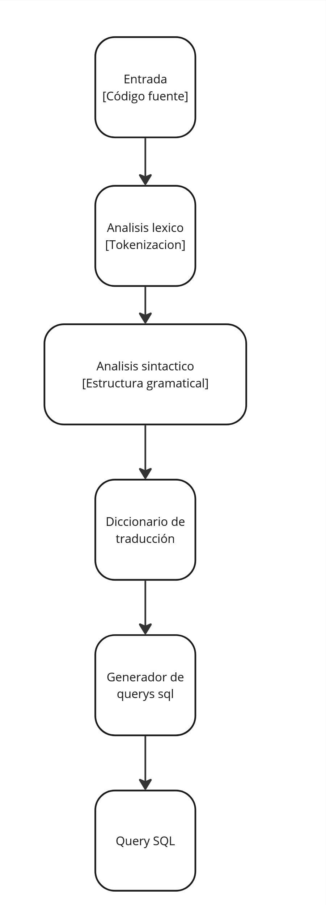
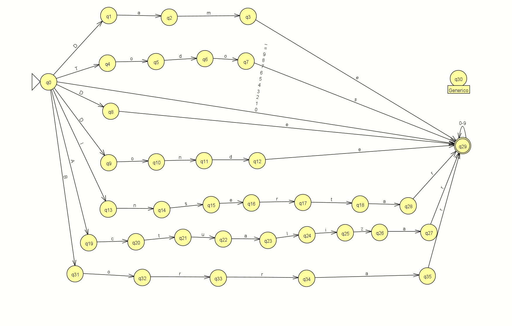
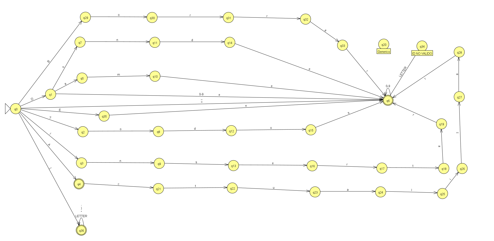

# COMPILADOR DE LENGUAJE NATURAL A SQL

## Resumen

- El objetivo principal de este proyecto es desarrollar un compilador sencillo que convierta frases en lenguaje natural en consultas SQL utilizando lso metodos básicos de SQL. Este proyecto busca automatizar y simplificar la generación de consultas SQL a partir de instrucciones simples, mejorando la accesibilidad a la programación de bases de datos.

## Motivación y Problema a Resolver

- **Descripción del problema:**
  El uso de SQL para acceder a bases de datos es una habilidad que no todos dominan, lo que limita su acceso a usuarios no técnicos. Este compilador pretende facilitar este acceso y podrai servir como una herramienta de aprendizaje.

- **Importancia:**
  Hacer mas accesible la creación de consultas SQL puede hacer que la gestión de bases de datos sea más facil para aquellos con poca o ninguna experiencia en programación.
- **Casos de uso:**
  Usuarios que necesitan generar consultas SQL de manera sencilla y rápida, como gerentes que necesitan reportes, analistas no técnicos, etc. Tambien una herramienta de aprendizaje

## Objetivos del Proyecto

- **Objetivo 1:**
  Desarrollar un compilador que transforme frases simples en consultas SQL.
- **Objetivo 2:**
  Implementar el autómata no determinista y el autómata determinista utilizando JFLAP. Convertir autómatas no deterministas a deterministas mediante una tabla de transición.
- **Objetivo 3:**
  Implementar el compilador en Python, con soporte para comandos básicos de SQL.
- **Objetivo 4**
  Mejorar el entendimiento de consultas SQL para personas no tecnicas.

## Revisión del Estado del Arte

- **Compiladores similares:**
  Con la inteligencia artificial han surgido varios proyectos o paginas que utilizan el mismo modelo para traducir de lengiaje natral a sql, como NL2SQL
- **Limitaciones de soluciones actuales:**
  Muy comunmente dependen de patrones predefinidos
- **Justificación del nuevo compilador:**
  Este proyecto ofrece una solución minimalista y específica, enfocada en las necesidades básicas de usuarios no técnicos.

## Arquitectura y Diseño del Compilador

- **Diagrama de bloques:**
  

- **Explicación del flujo de datos:**
  La entrada en lenguaje natural se analiza para identificar palabras clave, operadores e identificar que palabras se estan refiriendo al nomnre de una columna. Luego son transformados en una consulta SQL.
- **Decisiones de diseño:**
  Se implementaran los autómatas en JFLAP y se realizara la conversión a código Python para la compilación final.

## Análisis Léxico

- **Análisis léxico:**
  - La entrada en lenguaje natural se tokeniza para identificar palabras clave como “seleccionar”, “de” y operadores condicionales como “dónde”.
  - Se identificaran las palabras que se refieren a columnas
  - El abecedario va consistir en letras de a-z, numeros de 0-9, el simbolo de igual "=" y los espacios entre palabras se representaran con un guion bajo "\_"
- **Ejemplos:**

  - "dame_nombres_de_empleados_de_Mexicali"
  - "borrar_luis_de_empleados"
  - "dame_todos_los_usuarios_de_Cetys"

- Tokens: SELECT, nombre, FROM, empleados, WHERE, Mexicali, DELETE, luis, FROM, empleados, SELECT, \*, FROM, usuarios, cetys

## Diagramas:

**Automata finito no deterministico**

**Automata finito deterministico**

**Palabras clave**

- **"Dame"**: "SELECT",
- **"Todos"**: "\*",
- **"De"**: "FROM",
- **"Donde"**: "WHERE",
- **"Insertar"**: "INSERT",
- **"Actualizar"**: "UPDATE",
- **"Borrar"**:"DELETE"
- **"En"** : "IN",
- **"Valores":**"VALUES",
- **"A":**"INTO",
- **"El":**"SET",
- **"Los":**"SET".

## Análisis Sintáctico

- **Análisis sintáctico:**

GRAMATICA

INSERT: \
InsertQuery -> INSERT INTO Table Values ValesGroup \
ValuesGroup -> “(“ Values ”)”  ValuesGroupPrime \
ValuesGroupPrime -> “,” ValuesGroup | Epsilon \
Values -> Value ValuePrime \
ValuePrime -> “,” Value | Epsilon \
Table -> IDENTIFIER \
VALUE -> IDENTIFIER | NUMBER

DELETE:

DeleteQuery -> DELETE FROM Table WhereClause \
WhereClause -> WHERE Condition | Epsilon \
Condition -> Column Operator Value \
Operator -> "=" | ">" | "<" \
Column -> IDENTIFIER \
Table -> IDENTIFIER \
Value -> IDENTIFIER | NUMBER

SELECT:
 
SelectQuery -> SELECT Columns FROM Table WhereClause \
Columns -> * | ColumnList \
ColumnList -> Column ColumnListPrime \ 
ColumnListPrime - > "," ColumnList | Epsilon \
WhereClause -> WHERE Condition | Epsilon \
Condition -> Column Operator Value \
Operator -> "=" | ">" | "<" \
Column -> IDENTIFIER \
Table -> IDENTIFIER \
Value -> IDENTIFIER | NUMBER

UPDATE: 

UpdateQuery -> UPDATE Table SET Assignments WhereClause \
Assignments -> Assignment AssignmentPrime \
AssignmentsPrime -> "," Assignments | Epsilon \
Assignment -> Column "=" Value \
WhereClause -> WHERE Condition | Epsilon \
Condition -> Column Operator Value \
Operator -> "=" | ">" | "<" \
Column -> IDENTIFIER \
Table -> IDENTIFIER \
Value -> IDENTIFIER | NUMBER

La forma de implementacion del parser consiste en hacer un metodo para cada regla en donde se llama a cada metodo conforme va recibiendo los tokens. Para saber que parser vamos a usar tenemos que leer el primer token de la query.

- **Ejemplos:**

INSERT Query:      
Entrada: INSERT INTO Users VALUES (John, 25)

InsertQuery -> INSERT INTO Table ValuesGroup \
Table -> IDENTIFIER (Users)      \
ValuesGroup -> ( Values )    \
Values -> Value ValuePrime \
Value -> IDENTIFIER (John) \
ValuePrime -> , Value    \
Value -> NUMBER (25)  \
ValuesGroupPrime -> Epsilon

DELETE Query:   \
Entrada: DELETE FROM Logs \
DeleteQuery -> DELETE FROM Table WhereClause\
Table -> IDENTIFIER (Logs)\
WhereClause -> Epsilon

SELECT QUERY: SELECT * FROM Customers\
SelectQuery -> SELECT Columns FROM Table WhereClause\
Columns -> *\
Table -> IDENTIFIER (Customers)\
WhereClause -> Epsilon

UPDATE QUERY: UPDATE Products SET price = 50\
UpdateQuery -> UPDATE Table SET Assignments WhereClause\
Table -> IDENTIFIER (Products)\
Assignments -> Assignment AssignmentPrime\
Assignment -> Column = Value\
Column -> IDENTIFIER (price)\
Value -> NUMBER (50)\
AssignmentPrime -> Epsilon\
WhereClause -> Epsilon

## Análisis Semántico

- **Análisis :**
En escencia, el analizador semantico vuelve a recorrer el arbol sintactico, ignorando los nombres de los nodos y busca que las tablas y columnas existan en el esquema de la base de datos.\
Tambien se asegura que las condiciones WHERE sean compatibles en cuanto a tipo.

- **Ejemplos:**

Consulta de ejemplo: *Actualizar productos El precio = 75 , stock = stock - 1 Donde id > 1*
Despues de tokenizar y analizar sintacticamente, se volvera a recorrer el arbol y buscara que en el esquema se valide si precio es un campo tipo INT, stock VARCHAR e Id INT. En caso de haber discrepancia de tipos se lanza un error, e impidiendo que se termine de procesar la consulta.

## Pruebas y Validación

- **Metodología de pruebas:**
Para probar el compilador simplemente diseñamos una consulta de cada tipo para probar su funcionamiento probamos las siguientes:
- Input: Insertar A clientes Valores (1, "Juan", 30, "juan.perez@gmail.com")
- Input: Dame id, nombre De clientes Donde edad > 18
- Input: Borrar De productos Donde precio > 50
- Input: Actualizar productos El precio = 75 , stock = stock - 1 Donde id > 1

- **Resultados obtenidos:**
Cada resultado de cada consulta respectivamente:
- Output: INSERT INTO clientes VALUES ( 1 , " Juan " , 30 , " juan.perez@gmail.com " )
- Output: SELECT id , nombre FROM clientes WHERE edad > 18
- Output: DELETE FROM productos WHERE precio > 50
- Output: UPDATE productos SET precio = 75 , stock = stock - 1 WHERE id > 1
- **Casos de prueba específicos:**

## Herramientas y Entorno de Desarrollo

- **Lenguajes de programación utilizados:**
Se utilizo python para desarrollar el compilador.
- **Herramientas de desarrollo:**
Solo se uso el editor de codigo VS code y Python 3.11.
- **Entorno de pruebas y simulación:**
El entorno solo consiste en el mismo codigo, en el archivo de input.txt se colocaban las consultas y se ejecutaba el codigo, el cual mostraba el proceso de tokenizacion, el resultado del arbol sintactico y coincidencias de tablas y columnas en el analizador semantico.

## Demostración

- **Ejemplo de código fuente:**
En el siguiente codigo, se hace la tokenizacion, donde se toma el automata, y por cada palabra de la lista, se procesa caracter por caracter hasta formar la palabra y corrobora de que tipo es de acuerdo al automata.
Y al final se hace un conteo de parentesis para asegurarnos que estan correctamente balanceados
<pre>
def process_word(word, automaton, keywords):

    state = 'd0'

    read_word = []

    for char in word:

        #print(char)

        transitions = automaton.get(state, {})

        next_state = transitions.get(char, 'q_generic')

        #next_state = automaton.get(state, {}).get(char, 'q_generic')  # q_generic as default state if no valid transitions
       
        read_word.append(char)  # Agrega el carácter directamente a read_word
      
        #print(f"Transition: {state} --({char})--> {next_state}")
        state = next_state

    if state == 'd6' or state == 'd4':  # Acceptance states
        if word in keywords:
            return (keywords[word], "KEYWORD")
        if word.isdigit():
            return (word, "NUMBER")
        if word in["=",">","<"]:
            return (word, "OPERATOR")
        
    elif state == 'd36':
        if word in ['(', ')', '"', ',']:
            return (word, "PUNCTUATION")
    elif state == 'd34':
        raise ValueError(f"ERROR: INVALID IDENTIFIER {read_word}")
    else:
        return (word,"IDENTIFIER")

def tokenize(processed_string, automaton, keywords):
    
    tokens = []
    open_parentheses = 0
    closed_parentheses = 0 
    open_quotes = 0

    for word in processed_string:
        processed_word, token_type = process_word(word, automaton, keywords)
        tokens.append((processed_word, token_type))
        if processed_word == '(':
            open_parentheses += 1
        if processed_word == ')':
            closed_parentheses += 1
        
        if processed_word == '"':
            open_quotes += 1

    if open_parentheses != closed_parentheses:
        raise ValueError (word, "ERROR: Unbalanced parentheses")

   
    if open_quotes % 2 != 0:
        raise ValueError (word, "ERROR: Unmatched quotes")

    return tokens
        </pre>

- **Proceso de compilación:**
El proceso de compilacion es el siguiente: 
<pre>

if __name__ == "__main__":

    file =  './Resources/input.txt'
    string = read_file(file)
    #print(string)
    if string:
        string_no_spaces = replace_spaces(string)
        #print(string_no_spaces)
        processed_string = extract_words(string_no_spaces)
        #print(processed_string)
        tokens = tokenize(processed_string, Automaton, keywords)
        tokens_aux = deepcopy(tokens) 
        #print_table(tokens)
        input_correctness = False
               
        print(tokens)
        query_type = tokens[0][0]
        #print(query_type)

        if query_type == 'INSERT':
            parse = ParseInsert(tokens)
            parse_tree = parse.parse_insert()
            parse_tree.print_productions()
            
        if query_type == 'DELETE':
            parse = ParseDelete(tokens)
            parse_tree = parse.parse_delete()
            parse_tree.print_productions()

        if query_type == 'UPDATE':
            parse = ParseUpdate(tokens)
            parse_tree = parse.parse_update()
            parse_tree.print_productions()
            
        if query_type == 'SELECT':
            parse = ParseSelect(tokens)
            parse_tree = parse.parse_select()
            parse_tree.print_productions()

        #Analizador semantico

        if query_type == 'INSERT':
            parse = SemanticInsert(esquema_base_datos)  
            parse.analize(parse_tree)  
            input_correctness = True
        if query_type == 'DELETE':
      
            parse = SemanticDelete(esquema_base_datos)  
            parse.analize(parse_tree)  
            input_correctness = True    
        if query_type == 'UPDATE':
            parse = SemanticUpdate(esquema_base_datos)  
            parse.analize(parse_tree)  
            input_correctness = True
            
        if query_type == 'SELECT':
            parse = SemanticSelect(esquema_base_datos)  
            parse.analize(parse_tree)  
            input_correctness = True
            

    if input_correctness:
        output = ""
        for token, token_type in tokens_aux:
            
            output+= token + " "
        print(f"{output}")
    

</pre>

Extraemos la consulta del input.txt, separamos las palabras y luego secuencialmente, se envian a los analizadores. Si en alguno de estos ocurre algo que no esta bien, error de parentesis, error sintactico o semantico se envia un error directamente que informa al usuario y se detiene el proceso.
- **Ejecución del código compilado:**
La salida que produce el programa es esta, por consola, mostramos la tokenizacion, el arbol sintactico y mensajes del analizador semantico para saber que cada paso se esta haciendo bien o mal. Finalmente, tenemos la consulta en SQL que deberia ser funcional si el esquema coincide proveido coincide con la base de datos en el gestor SQL
<pre>
[('UPDATE', 'KEYWORD'), ('productos', 'IDENTIFIER'), ('SET', 'KEYWORD'), ('precio', 'IDENTIFIER'), ('=', 'OPERATOR'), ('75', 'NUMBER'), (',', 'PUNCTUATION'), ('stock', 'IDENTIFIER'), ('=', 'OPERATOR'), ('stock', 'IDENTIFIER'), ('-', 'IDENTIFIER'), ('1', 'NUMBER'), ('WHERE', 'KEYWORD'), ('id', 'IDENTIFIER'), ('>', 'OPERATOR'), ('1', 'NUMBER')]
UpdateQuery
UPDATE
Table
productos
SET
Assignments
Assignment
Column
precio
=
Value
75
,
Assignments
Assignment
Column
stock
=
Value
stock
WhereClause
Epsilon
Tabla 'productos' encontrada en la base de datos.
falta condicional
UPDATE productos SET precio = 75 , stock = stock - 1 WHERE id > 1
</pre>
## Desafíos y Soluciones

- **Problemas técnicos o de diseño:**
- El analizador semántico necesita de un esquema para poder funcionar, de lo contrario, no tendríamos manera de saber que tablas o columnas existen o no.
- Al separar palabras, necesitamos saber dónde empieza una y termina otra para poder reconocer adecuadamente la cadena (INPUT) del usuario.

- **Estrategias adoptadas para superar desafíos:**
- Implementamos un esquema de una base de datos con tablas y columnas que nos ayuda a que el analizador semántico funcione. U otra solucion pudo haber sido no hacer el analizador semantico, puesto que el esquema de la base de datos sale del alcance de nuestro compilador al no contar con un gestor implementado.

- Utilizamos un carácter especial para delimitar las palabras y con ello separar las palabras se volvió sencillo.

- **Lecciones aprendidas:**
- La complejidad y la importancia de definir lo mejor posible el alcance desde el inicio.
- Se requiere tiempo.
- Investigar el estado del arte es importante.
- Investigar proyectos del mismo area, independientemente si estan relacionados con lo que queremos hacer.

## Conclusiones y Trabajo Futuro

- **Resumen de objetivos cumplidos:**
Se pudo realizar los tres analizadores satisfactoriamente.
- **Evaluación del desempeño:**
Si bien, los tres analizadores son funcionales, todavia queda por mejorar el alcance del proyecto y que sea todavia mas facil de usar para aquellos que no tienen conicimiento de sql.
- **Propuestas para mejoras futuras:**
Expandir el lenguaje para permitir varias maneras decir consultas. 
Expandir la complejidad de las consultas para permitir varias maneras de decir una misma consulta y expandir las palabras clabe para admitir ORDER BY o condiciones anidadas.
## Preguntas y Discusión

- Espacio para responder preguntas y discusión sobre el proyecto.

## Referencias

- **Fuentes citadas:** Lista de libros, artículos, papers, y otras fuentes relevantes.
